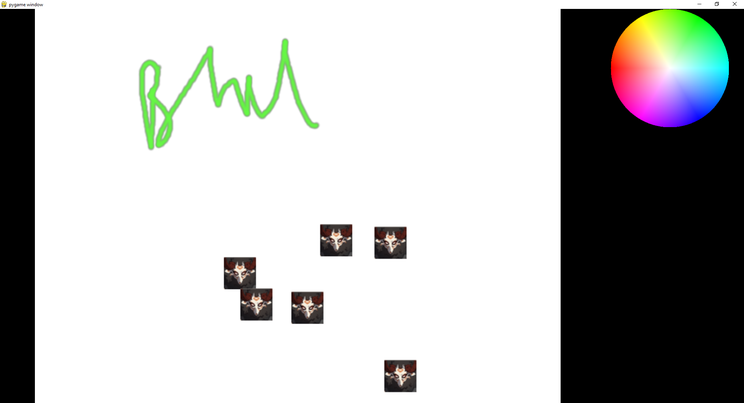

Simple doodling + stamp application



*Icons used here are from the "Teyvat Interactive Map" from Hoyoverse, I am not affiliated with them in any way*

# Install

```
conda create -n "doodle" python=3.10
conda activate doodle
```

Install dependencies
```
pip install -r requirements.txt
```

# Run

```
conda activate doodle
# Replace with name of the directory if you checked out differently
python -m doodle
```

# Use

### Adding stamps
You can add stamps / brushes that you want accessible as .png files in the `stamps/` directory.

### General

ESC / X-button: Close

CTRL + S = Save current drawing to "saved/*". Saving multiple times in the same session will overwrite

CTRL + SHIFT + S = Forget previous saves, start a fresh save.

Left Click (in Canvas on left side): Draw / Erase

----

Drawing:

0 - Return to basic brush
O/P - previous/next brush
Left click on color wheel - set tint color
Right click on color wheel - clear tint color (white)
B - toggle between "stamp" (click) and "brush" (click and drag) modes
E - toggle between eraser and normal mode (HW cursor means eraser)
Brackets `[` and `]`: Smaller/Bigger brush

X (while held) - Lock mouse movement to only the X axis
Y (while held) - Lock mouse movement to only the Y axis

Layers:

CTRL + N = New Layer
CTRL + DOWN = Select layer below
CTRL + UP = Select layer above
CTRL + D = Delete current layer

